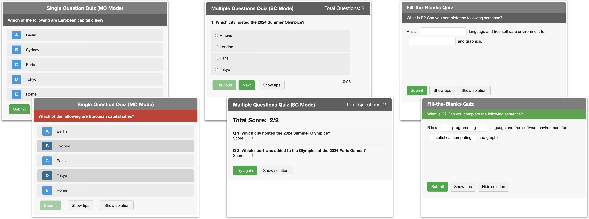

<!-- README.md is generated from README.Rmd. Please edit that file -->

# rquiz 

<!-- badges: start -->

[](https://cran.r-project.org/package=SCIproj)
[](https://github.com/saskiaotto/rquiz/actions/workflows/R-CMD-check.yaml)
[](https://cran.r-project.org/package=rquiz)
[](LICENSE)
<!-- badges: end -->

**rquiz** provides interactive quizzes as HTML widgets for R Markdown,
Quarto, and Shiny applications. It offers three quiz types: a single
question with instant feedback (`singleQuestion`), a multi-question quiz
with navigation, timer, and results (`multiQuestions`), and
fill-in-the-blank cloze exercises (`fillBlanks`). All quizzes support
single-choice and multiple-choice modes, customizable styling, and
multilingual UI.

I developed this package for my **Data Science in Biology** modules at
the University of Hamburg, where I have been using and testing it with
students since 2020 in HTML-based lecture slides (see
e.g. [fill-in-the-blank
quiz](https://saskiaotto.github.io/uham-bio-data-science-1/05-r-basics-variables-vectors.html#/quiz-1-zuweisungen)
and [multi-page
quiz](https://saskiaotto.github.io/uham-bio-data-science-1/05-r-basics-variables-vectors.html#/abschlussquiz-1)
in my Data Science 1 course).

## Installation

You can install the released version of rquiz from
[CRAN](https://cran.r-project.org/package=rquiz) with:

``` r
install.packages("rquiz")
```

Or install the development version from GitHub:

``` r
# install.packages("remotes")
remotes::install_github("saskiaotto/rquiz")

# or alternatively
# install.packages("pak")
pak::pkg_install("saskiaotto/rquiz")
```

## Quiz Types

<figure style="text-align: center;">


<figcaption style="font-size: 0.9em; color: #666;">

Single-question quiz (left), multi-page quiz (center), and
fill-the-blanks quiz (right).
</figcaption>

</figure>

## Features

- **Three quiz types**: Single question with instant feedback
  (`singleQuestion`), multi-question quiz with navigation, timer, and
  results (`multiQuestions`), fill-in-the-blank cloze (`fillBlanks`)
- **Immediate feedback**: Visual feedback (color changes) on answers
- **Customizable design**: Colors, fonts, sizes — all configurable;
  reusable themes via `rquizTheme()`
- **Multilingual**: Built-in support for English, German, French, and
  Spanish currently
- **Accessible**: ARIA labels, keyboard navigation, focus indicators
- **Shuffling**: Randomize answer options or question order
- **No dependencies**: Pure Vanilla JavaScript, no jQuery

## Learn More

- [Creating
  Quizzes](https://saskiaotto.github.io/rquiz/articles/creating-quizzes.html)
  — Detailed guide with examples
- [Gallery](https://saskiaotto.github.io/rquiz/articles/gallery.html) —
  Interactive demo of all quiz types
- [Demo
  Files](https://saskiaotto.github.io/rquiz/articles/slides-demo.html) —
  Ready-to-use templates for Quarto, Slidy, and RevealJS
- [Function
  Reference](https://saskiaotto.github.io/rquiz/reference/index.html) —
  Full API documentation

## Credits

1.  The development of the `singleQuestion` quiz was inspired by Ozzie
    Kirkby and his JS/HTML/CSS code on
    [codepen.io](https://codepen.io/ozzie/pen/pvrVLm).
2.  The development of the `multiQuestions` quiz was inspired by
    Abhilash Narayan and his JS/HTML/CSS code on
    [codepen.io](https://codepen.io/abhilashn/pen/BRepQz).
